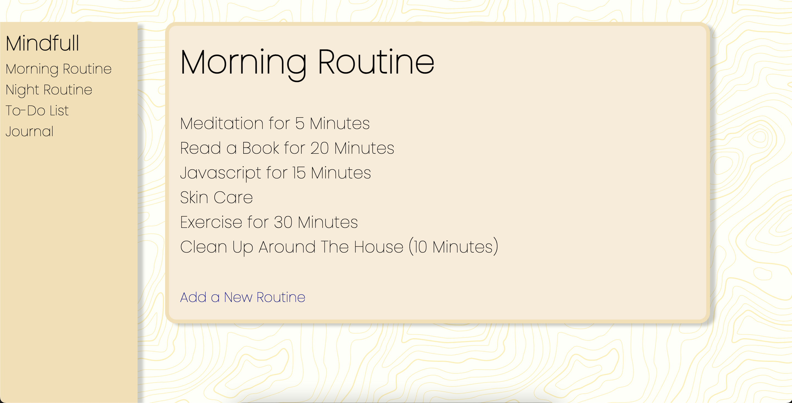
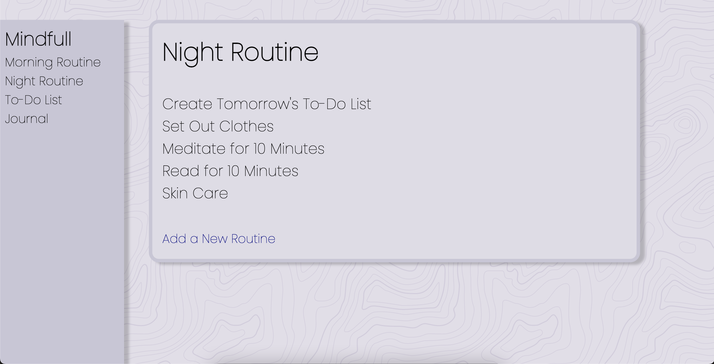
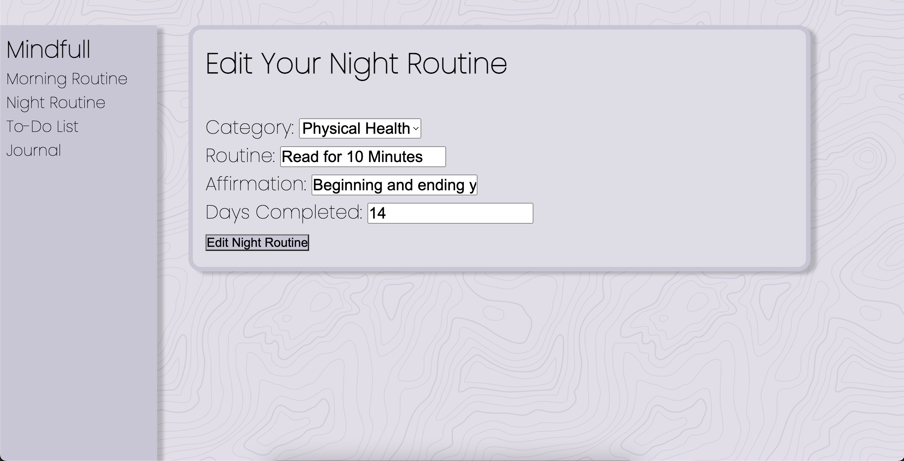
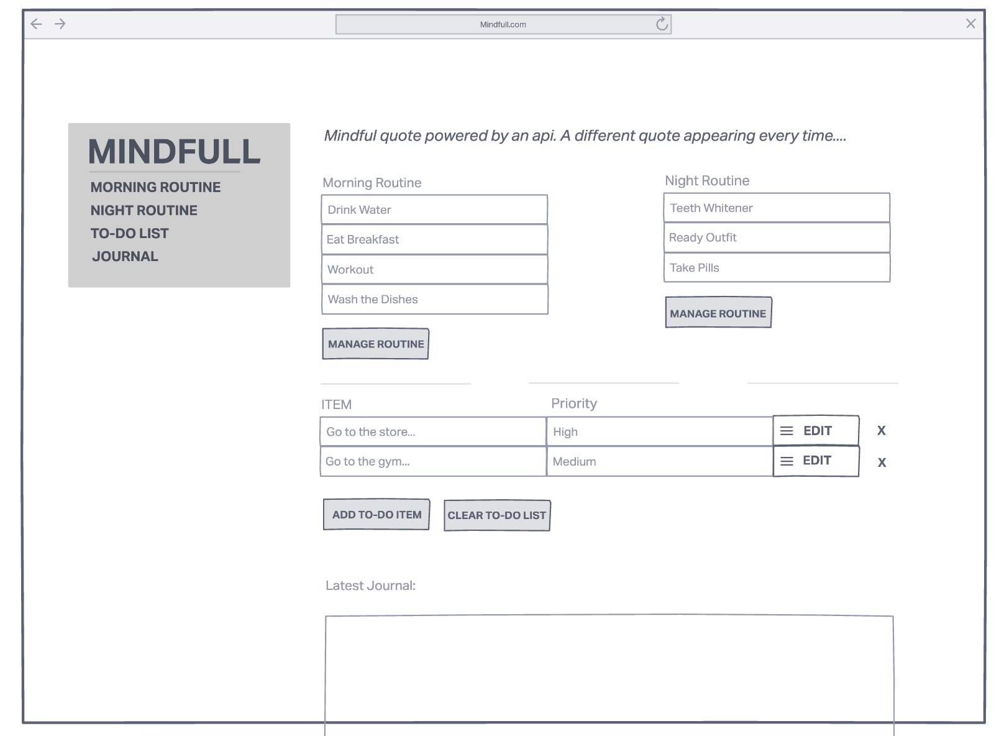

# The Mindfull Application

#### A full crud web app designed to help build routines, set goals, and journal

## Description
Mindfull is my first attempt at building a full CRUD application- four times over. This app allows you to create your own morning routine, night routine, to-do list, and journal. Beyond that- the CSS is completely vanilla in an effort to solidify CSS foundations.

## Table of Contents
* [Technologies Used](#technologiesused)
* [Features](#features)
* [Design](#design)
* [Project Next Steps](#nextsteps)
* [Deployed App](#deployment)
* [About the Author](#author)

## Technologies Used
* JavaScript
* HTML5
* CSS3
* Node.Js
* MongoDB
* Express.js
* RESTful Routes

## Features
* Users can run full C.R.U.D. operation on 4 seperate models
* User has the ability to navigate between the 4 seperate models in one, convenient place.

## Wireframe
* InVision Wireframe:

## Trello Planning
* Link to Trello: https://trello.com/invite/b/OZyNhCjx/1b7a7a29aff6846352f766a5c83e5ea8/mindfull-application

## Design
* Design elements implemented using vanilla CSS.

## Project Next Steps
* Users will be able to see a summary page of every CRUD model.
* Users will be able to log-in to the application and store data.

## Deployed Link
* [Heroku Deployment](https://project-mindfull.herokuapp.com/morning)

* You can view the repository:
[Github.com](https://github.com/CoryMetcalf96/Mindfull)
* If unable to view please go live locally through VS Code
    

## About The Author
I build applications and mini projects tied to my various interests. I look for creative solutions to real world problems and think of technical ways to address them. While no application is ever perfect I find joy in the process and all my final products!